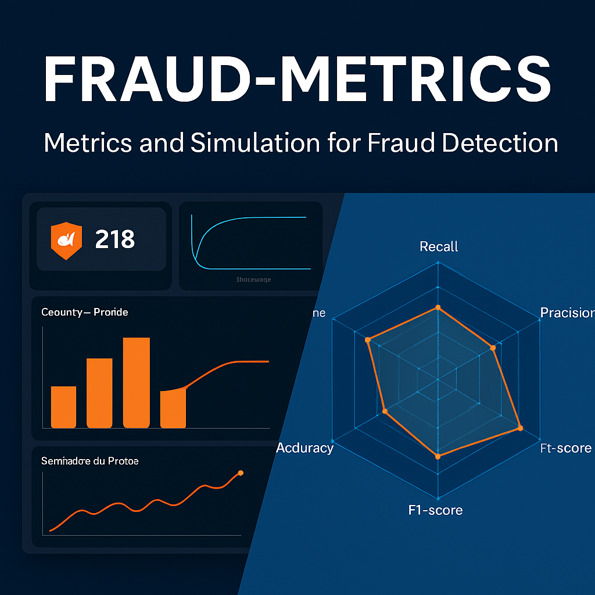

# FRAUD-METRICS-Project

# 📊 Projeto FRAUDE-MÉTRICAS / FRAUD-METRICS Project

---

## 🏅 Badges

- 📦 Tamanho do repositório / Repository Size:  
  

- 📄 Licença do projeto / Project License:  
  

---

## 📋 Índice / Table of Contents

- [Descrição / Description](#descrição--description)  
- [Status / Status](#status--status)  
- [Funcionalidades / Features](#funcionalidades--features)  
- [Acesso / Access](#acesso--access)  
- [Tecnologias / Technologies](#tecnologias--technologies)  
- [Desenvolvedor / Developer](#desenvolvedor--developer)  
- [Licença / License](#licença--license)  
- [Conclusão / Conclusion](#conclusão--conclusion)  

---

## 📖 Descrição do Projeto / Project Description

**PT:**  
O **FRAUDE-MÉTRICAS** é uma aplicação analítica desenvolvida para **simular, visualizar e comparar métricas de custo** em cenários diversos. Embora tenha sido criada para detecção de fraudes, sua estrutura flexível permite aplicação em áreas como **produtos danificados**, **doenças raras**, **riscos operacionais** e muito mais.

A ferramenta integra:
- Processamento de dados com Pandas  
- Visualizações interativas com Plotly  
- Relatórios exportáveis (.csv e .html)  
- Interface intuitiva via Streamlit

**EN:**  
**FRAUD-METRICS** is an analytical application designed to **simulate, visualize, and compare cost metrics** across multiple scenarios. While originally built for fraud detection, its flexible architecture allows use in areas such as **damaged products**, **rare diseases**, **operational risks**, and more.

The tool integrates:
- Data processing with Pandas  
- Interactive visualizations using Plotly  
- Exportable reports (.csv and .html)  
- Intuitive interface powered by Streamlit

---

## 🚀 Execução / Execution

**PT:**  
Para executar o projeto localmente com Streamlit:

bash
streamlit run app.py

---

## 🚧 Status do Projeto / Project Status

✅ Projeto finalizado e funcional ✅ Executado via Streamlit com interface web interativa ✅ Pronto para testes, demonstrações e adaptações

✅ Project completed and functional ✅ Implemented via Streamlit with an interactive web interface ✅ Ready for testing, demonstrations, and adaptations

---

## ⚙️ Funcionalidades / Features

| 🧩 Funcionalidade (PT)              | 💡 Description (EN)                       |
|--------------------------------------|-------------------------------------------|
| 📊 Geração de métricas               | 📊 Generation of fraud detection metrics  |
| 📈 Visualização de dados             | 📈 Interactive data visualization         |
| 🏭 Simulação de custos               | 🏭 Cost simulation for fraud scenarios    |
| 📂 Exportação de relatórios (.csv)   | 📂 Export reports in .csv format          |
| 🔍 Comparação entre modelos          | 🔍 Compare multiple detection models      |
| 📉 Curva Precisão-Recall              | 📉 Precision-Recall curve visualization   |
| 🗺 Heatmap de análises                | 🗺 Customizable analysis heatmap           |

---

## 🌐 Acesso ao Projeto / Access to the Project

- [Repositório GitHub / GitHub Repository](https://github.com/Rogerio5/fraude-metricas)

---

## 🧰 Tecnologias Utilizadas / Technologies Used

  
  
  
  
  

  

 

---

## 👨‍💻 Pessoa Desenvolvedora do Projeto / Project Developer

- [Rogerio](https://github.com/Rogerio5)

---

## 📜 Licença / License

Este projeto está sob licença MIT. Para mais detalhes, veja o arquivo `LICENSE`.  

This project is under the MIT license. For more details, see the `LICENSE` file.

---

## 🏁 Conclusão / Conclusion

PT: O FRAUDE-MÉTRICAS vai muito além de cenários de fraude: sua estrutura flexível permite aplicá-lo também na análise de produtos danificados, doenças raras e outros contextos onde métricas de custo e impacto sejam cruciais. Seja para reduzir perdas financeiras, otimizar recursos ou apoiar decisões estratégicas, essa ferramenta entrega resultados claros e visuais que tornam a análise de dados muito mais intuitiva.

EN: FRAUD-METRICS goes far beyond fraud scenarios: its flexible architecture also makes it suitable for analyzing damaged products, rare diseases, and many other contexts where cost and impact metrics are critical. Whether aiming to reduce financial losses, optimize resources, or support strategic decision-making, this tool delivers clear, visual results that make data analysis far more intuitive.
